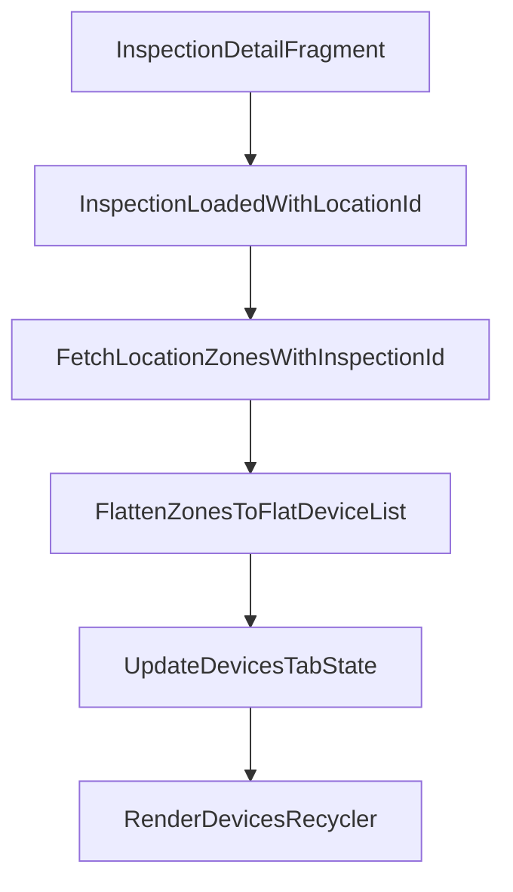

# Plan para cargar devices en Inspection Details

## Diagnóstico

Hoy la tab `Devices` de `inspection details` carga por `buildingId` desde Room y no dispara ningún fetch específico de devices para la inspección.

Archivos clave:

- [android-app/app/src/main/java/com/example/tup_final/ui/inspection/DevicesFragment.java](android-app/app/src/main/java/com/example/tup_final/ui/inspection/DevicesFragment.java)
- [android-app/app/src/main/java/com/example/tup_final/ui/inspection/InspectionDetailViewModel.java](android-app/app/src/main/java/com/example/tup_final/ui/inspection/InspectionDetailViewModel.java)
- [android-app/app/src/main/java/com/example/tup_final/data/repository/InspectionRepository.java](android-app/app/src/main/java/com/example/tup_final/data/repository/InspectionRepository.java)
- [android-app/app/src/main/java/com/example/tup_final/data/repository/InspectionTestsRepository.java](android-app/app/src/main/java/com/example/tup_final/data/repository/InspectionTestsRepository.java)
- [android-app/app/src/main/java/com/example/tup_final/data/remote/ZonesApi.java](android-app/app/src/main/java/com/example/tup_final/data/remote/ZonesApi.java)
- [backend/src/main/java/com/inspections/service/ZoneService.java](backend/src/main/java/com/inspections/service/ZoneService.java)

Código relevante actual:

```73:76:android-app/app/src/main/java/com/example/tup_final/ui/inspection/InspectionDetailViewModel.java
public void loadDevices(String buildingId) {
    devices = (MutableLiveData<Resource<List<DeviceEntity>>>)
            inspectionRepository.getDevicesByBuildingId(buildingId);
}
```

```42:47:android-app/app/src/main/java/com/example/tup_final/ui/inspection/DevicesFragment.java
if (resource.getStatus() == Resource.Status.SUCCESS
        && resource.getData() != null
        && resource.getData().buildingId != null) {
    viewModel.loadDevices(resource.getData().buildingId);
    observeDevices(viewModel);
}
```

## Estrategia elegida

Reutilizar el endpoint existente de zonas de una location y aplanar `zones -> devices` en Android.




## Cambios propuestos

### 1. Reemplazar la carga por `buildingId`

- Cambiar la tab `Devices` para que use `inspection.locationId` + `inspectionId`, no `buildingId`.
- Dejar de depender de `DeviceDao.getByBuildingId(...)` para esta pantalla.

### 2. Reutilizar la lógica de fetch ya existente

- Extraer o reutilizar desde [android-app/app/src/main/java/com/example/tup_final/data/repository/InspectionTestsRepository.java](android-app/app/src/main/java/com/example/tup_final/data/repository/InspectionTestsRepository.java) la llamada a [android-app/app/src/main/java/com/example/tup_final/data/remote/ZonesApi.java](android-app/app/src/main/java/com/example/tup_final/data/remote/ZonesApi.java).
- Consumir `GET /locations/{locationId}/zones?inspectionId=...` como fuente de verdad para la tab.

### 3. Aplanar `zones -> devices`

- Mapear la respuesta `List<ZoneWithDevicesResponse>` a una lista flat de `DeviceEntity` o a un `DeviceUiModel` específico para la tab.
- Mantener solo los campos que la tab necesita renderizar.
- Evaluar si conviene enriquecer el item con `zoneName` para que el usuario entienda de qué zona viene cada device.

### 4. Ajustar ViewModel y estado de pantalla

- En [android-app/app/src/main/java/com/example/tup_final/ui/inspection/InspectionDetailViewModel.java](android-app/app/src/main/java/com/example/tup_final/ui/inspection/InspectionDetailViewModel.java), cambiar `loadDevices(...)` para que cargue por `locationId + inspectionId`.
- Exponer un `LiveData<Resource<List<...>>>` que la tab observe una sola vez por ciclo de vista.
- Evitar registrar observers repetidos dentro del observer de `inspection`.

### 5. Adaptar `DevicesFragment`

- En [android-app/app/src/main/java/com/example/tup_final/ui/inspection/DevicesFragment.java](android-app/app/src/main/java/com/example/tup_final/ui/inspection/DevicesFragment.java), disparar la carga cuando la inspección llegue con `locationId`.
- Conservar estados `LOADING`, `SUCCESS`, `ERROR`, y empty state cuando realmente no haya devices.

### 6. Verificar si hace falta tocar backend

- No crear endpoint nuevo.
- Solo validar que el contrato actual de [backend/src/main/java/com/inspections/service/ZoneService.java](backend/src/main/java/com/inspections/service/ZoneService.java) devuelve todos los devices de todas las zones de la `locationId` de la inspección.
- Si la tab necesita mostrar `zoneName`, confirmar que ya viene en `ZoneWithDevicesResponse` y resolverlo del lado Android durante el flatten.

## Riesgos a controlar

- La app hoy mezcla `buildingId` en `inspection details` con un backend que asocia la inspección a una sola `locationId`.
- Si se reutiliza `DeviceEntity` para la tab, puede haber inconsistencias con campos que hoy se llenan desde otros flujos.
- `DevicesFragment` hoy llama `observeDevices(viewModel)` dentro del observer de inspección; conviene simplificar eso para no acumular observers.

## Validación

- Abrir `inspection details` de una inspección con devices en varias zones y verificar que la tab `Devices` muestre todos.
- Verificar que una inspección sin devices muestre empty state.
- Confirmar que al volver desde otros flujos o recrear el fragment no se duplique la lista ni observers.
- Verificar coherencia con el flujo `InspectionTestsFragment`, que ya consume `locationId + inspectionId`.

## Resultado esperado

La tab `Devices` deja de depender de cache por edificio y pasa a reflejar correctamente todos los devices pertenecientes a la inspección actual, agregando en una sola lista los devices distribuidos en todas las zones de esa location.