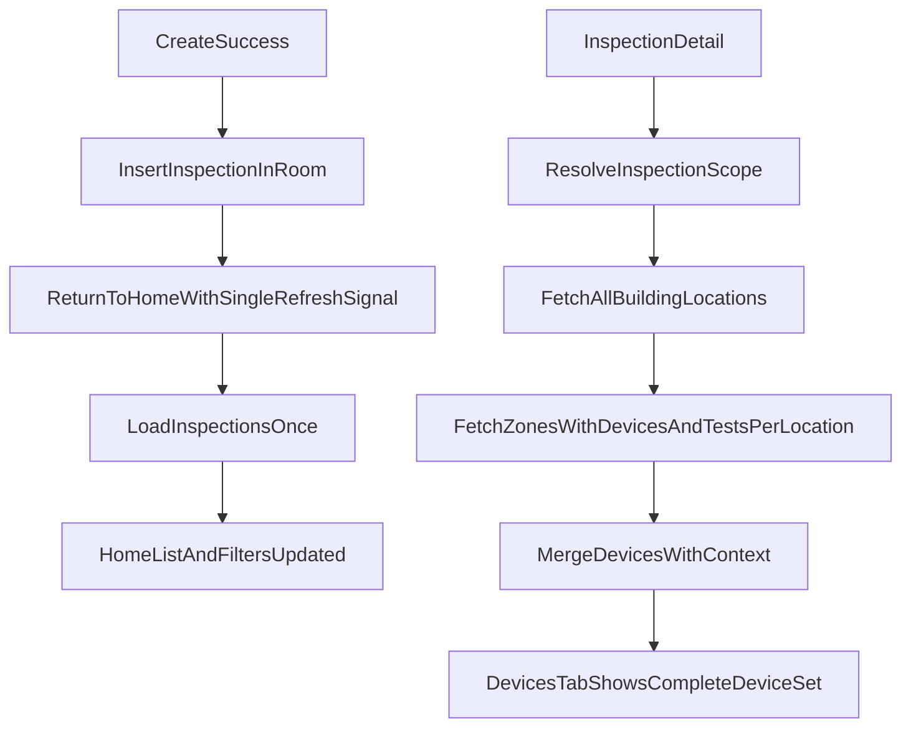

# Plan para mitigar refresh de inspections y devices incompletos

## Diagnóstico validado

- El refresh de `Home` hoy es funcional pero frágil. `HomeViewModel` ya carga al inicializar y además `HomeFragment` vuelve a llamar `loadInspections()` en `onResume()`, mientras el resultado de creación también dispara otra recarga desde el listener. Eso introduce recargas duplicadas, flicker y dependencia de un `GET /inspections` inmediato para que la inspección recién creada aparezca.
- La tab `Devices` de `InspectionDetail` no está alineada con el modelo actual de inspecciones building-wide. En [android-app/app/src/main/java/com/example/tup_final/ui/inspection/DevicesFragment.java](android-app/app/src/main/java/com/example/tup_final/ui/inspection/DevicesFragment.java) y [android-app/app/src/main/java/com/example/tup_final/data/repository/InspectionTestsRepository.java](android-app/app/src/main/java/com/example/tup_final/data/repository/InspectionTestsRepository.java), si `inspection.locationId` existe se usa solo esa location, pero la navegación a locations usa solo `buildingId` desde [android-app/app/src/main/java/com/example/tup_final/ui/inspection/InspectionDetailFragment.java](android-app/app/src/main/java/com/example/tup_final/ui/inspection/InspectionDetailFragment.java).
- El backend actual crea inspecciones building-wide con `locationId = null` en [backend/src/main/java/com/inspections/service/InspectionService.java](backend/src/main/java/com/inspections/service/InspectionService.java), pero los datos seed aún contienen inspecciones con `locationId` poblado y tests repartidos en múltiples locations. Esa mezcla explica por qué el detalle de locations muestra más devices que la tab plana de devices.
- La UI plana de devices también pierde contexto importante: el adapter solo pinta `name`, `deviceCategory` y serial en [android-app/app/src/main/java/com/example/tup_final/ui/inspection/DeviceAdapter.java](android-app/app/src/main/java/com/example/tup_final/ui/inspection/DeviceAdapter.java), por eso visualmente puede parecer una lista de categorías en vez de una lista clara de dispositivos.

## Objetivo de corrección

- Hacer que la inspección creada aparezca en `Home` de forma consistente, sin depender de múltiples recargas ni de una ventana de consistencia del backend.
- Hacer que la tab `Devices` de `InspectionDetail` represente el mismo universo de devices que el flujo `InspectionDetail -> Locations -> Tests`.
- Eliminar el desalineamiento entre datos legacy y el modelo building-wide actual para evitar resultados parciales silenciosos.

## Plan de implementación

### 1. Normalizar el refresh de Home a un solo disparador confiable

- Revisar [android-app/app/src/main/java/com/example/tup_final/ui/home/HomeFragment.java](android-app/app/src/main/java/com/example/tup_final/ui/home/HomeFragment.java) para quitar la recarga incondicional de `onResume()` y dejar un único trigger explícito de refresh tras creación.
- Mantener un único mecanismo de retorno desde [android-app/app/src/main/java/com/example/tup_final/ui/createinspection/CreateInspectionFragment.java](android-app/app/src/main/java/com/example/tup_final/ui/createinspection/CreateInspectionFragment.java): fragment result o `SavedStateHandle`, pero no combinado con `onResume()`.
- Ajustar [android-app/app/src/main/java/com/example/tup_final/ui/home/HomeViewModel.java](android-app/app/src/main/java/com/example/tup_final/ui/home/HomeViewModel.java) para evitar `loadInspections()` concurrentes o repetidos mientras una carga esté en progreso.

### 2. Hacer robusta la aparición de la inspección recién creada

- Extender [android-app/app/src/main/java/com/example/tup_final/data/repository/CreateInspectionRepository.java](android-app/app/src/main/java/com/example/tup_final/data/repository/CreateInspectionRepository.java) para persistir localmente la inspección creada en Room apenas el `POST /inspections` responde exitosamente, mapeando `CreateInspectionResponse` a `InspectionEntity`.
- Coordinar ese cache write con [android-app/app/src/main/java/com/example/tup_final/data/repository/InspectionRepository.java](android-app/app/src/main/java/com/example/tup_final/data/repository/InspectionRepository.java) para que `Home` pueda reflejar el alta aunque el `GET /inspections` inmediato falle o todavía no incluya el nuevo registro.
- Refrescar también el origen de filtros de building/location en [android-app/app/src/main/java/com/example/tup_final/ui/home/HomeViewModel.java](android-app/app/src/main/java/com/example/tup_final/ui/home/HomeViewModel.java), porque hoy esos catálogos se cargan solo una vez.

### 3. Alinear `Devices` con el alcance building-wide real

- Cambiar la decisión de alcance en [android-app/app/src/main/java/com/example/tup_final/data/repository/InspectionTestsRepository.java](android-app/app/src/main/java/com/example/tup_final/data/repository/InspectionTestsRepository.java) para que, cuando la inspección sea building-wide o cuando exista inconsistencia legacy entre `locationId` y tests del building, la carga recorra todas las locations del `buildingId` en vez de priorizar ciegamente `locationId`.
- Revisar [android-app/app/src/main/java/com/example/tup_final/ui/inspection/DevicesFragment.java](android-app/app/src/main/java/com/example/tup_final/ui/inspection/DevicesFragment.java) y [android-app/app/src/main/java/com/example/tup_final/ui/inspection/InspectionDetailViewModel.java](android-app/app/src/main/java/com/example/tup_final/ui/inspection/InspectionDetailViewModel.java) para que el contrato de carga deje explícito si la tab representa una inspección building-wide o location-scoped.
- Mantener el comportamiento de [android-app/app/src/main/java/com/example/tup_final/ui/inspectionlocations/InspectionLocationsFragment.java](android-app/app/src/main/java/com/example/tup_final/ui/inspectionlocations/InspectionLocationsFragment.java) como referencia de verdad funcional, porque esa pantalla ya navega y muestra locations por `buildingId`.

### 4. Evitar subcuentas silenciosas y mejorar la observabilidad

- En [android-app/app/src/main/java/com/example/tup_final/data/repository/InspectionTestsRepository.java](android-app/app/src/main/java/com/example/tup_final/data/repository/InspectionTestsRepository.java), dejar de retornar `success(allDevices)` si alguna location falla silenciosamente. La carga debe propagar error, o al menos un estado parcial visible, cuando una location o una llamada a zonas no se pudo recuperar.
- Añadir fallback consistente al cache local para la carga plana de devices, similar al flujo jerárquico `getZonesWithDevicesAndTests(...)`, para que la experiencia no dependa solo del online best-effort.

### 5. Mejorar la representación de devices en Inspection Detail

- Reutilizar el modelo enriquecido del flujo jerárquico de [android-app/app/src/main/java/com/example/tup_final/ui/inspectiontests/InspectionTestsFragment.java](android-app/app/src/main/java/com/example/tup_final/ui/inspectiontests/InspectionTestsFragment.java) y su adapter como referencia para decidir si la tab `Devices` debe:
  - seguir siendo plana pero con contexto de location/zone, o
  - pasar a un agrupado por location/zone que refleje mejor la inspección real.
- Extender el contrato DTO si hace falta. El `DeviceWithTestsResponse` actual en [android-app/app/src/main/java/com/example/tup_final/data/remote/dto/DeviceWithTestsResponse.java](android-app/app/src/main/java/com/example/tup_final/data/remote/dto/DeviceWithTestsResponse.java) y [backend/src/main/java/com/inspections/dto/DeviceWithTestsResponse.java](backend/src/main/java/com/inspections/dto/DeviceWithTestsResponse.java) no trae un `deviceTypeName` ni etiquetas de zone/location para render claro; por eso hoy [android-app/app/src/main/java/com/example/tup_final/ui/inspection/DeviceAdapter.java](android-app/app/src/main/java/com/example/tup_final/ui/inspection/DeviceAdapter.java) termina mostrando algo que se percibe como categoría/tipo.

### 6. Sanear compatibilidad con datos legacy

- Auditar y corregir el seed en [backend/src/main/resources/data.sql](backend/src/main/resources/data.sql), donde existen inspecciones como `insp-001` con `location_id` poblado pero tests en múltiples locations.
- Decidir una regla única para datos legacy:
  - migrar esas inspecciones a `location_id = null`, o
  - limitar realmente sus tests a una sola location.
- Alinear esa decisión con [backend/src/main/java/com/inspections/service/InspectionService.java](backend/src/main/java/com/inspections/service/InspectionService.java), que ya crea inspecciones building-wide.

## Flujo objetivo

## Validación propuesta

- Crear una inspección nueva y verificar que aparece al volver a `Home` con una sola transición de loading.
- Repetir la prueba offline o forzando error en `GET /inspections` inmediatamente después del `POST` para confirmar que el cache local la sigue mostrando.
- Comparar, para una inspección con varias locations, el total de devices visibles en `InspectionDetail -> Devices` contra el universo visible en `InspectionDetail -> Locations -> [Location] -> Tests`.
- Verificar casos legacy del seed como `insp-001` y casos nuevos building-wide creados desde la UI.
- Confirmar que la tab `Devices` ya muestra identidad suficiente por device y no aparenta una lista de categorías.

