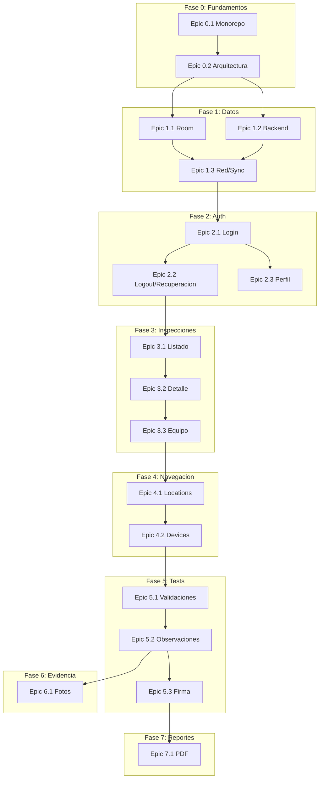

# Plan de Implementación - Inspections App

## Estado Actual del Proyecto

El proyecto está en estado **template básico**: solo existe `MainActivity` con "Hello World", sin arquitectura MVVM, sin Room, Retrofit, ni backend. La estructura actual no sigue el monorepo definido en la documentación.

**Corrección necesaria:** En [app/build.gradle](app/build.gradle) línea 8, `compileSdk { version = release(36) }` parece inválido; debe ser `compileSdk 36`.

---

## Fase 0: Estructura del Proyecto y Fundamentos (Semana 1)

### Epic 0.1: Reorganización Monorepo

Reestructurar el repo según la documentación:

```
proyecto-inspecciones/
├── android-app/          ← Mover contenido actual aquí
├── backend/              ← Nuevo (Spring Boot)
├── database/             ← Scripts SQL
├── docs/                 ← Documentación
└── README.md
```

**Tareas:**

- **T0.1.1** Crear estructura de carpetas `backend/`, `database/`, `docs/`
- **T0.1.2** Mover `app/`, `gradle/`, `build.gradle`, etc. dentro de `android-app/`
- **T0.1.3** Actualizar rutas en `settings.gradle` y `build.gradle` raíz
- **T0.1.4** Crear `README.md` con instrucciones de setup para Android, backend y DB

### Epic 0.2: Arquitectura Base Android

**Tareas:**

- **T0.2.1** Agregar dependencias en `libs.versions.toml` y `build.gradle`: Room, Retrofit, OkHttp, ViewModel, LiveData, Navigation Component, Hilt/Dagger2, Glide, WorkManager
- **T0.2.2** Configurar Hilt/Dagger2 (Application class, @HiltAndroidApp, módulos base)
- **T0.2.3** Configurar Navigation Component (NavHostFragment, graph)
- **T0.2.4** Crear estructura de paquetes: `data/`, `domain/`, `ui/`, `di/`, `util/`
- **T0.2.5** Implementar tema oscuro (dark theme) en `themes.xml` - sin light mode según alcance

---

## Fase 1: Capa de Datos y Backend (Semanas 2-3)

### Epic 1.1: Base de Datos Local (Room)

**Tareas:**

- **T1.1.1** Definir entidades: `User`, `Inspection`, `Location`, `Zone`, `Device`, `Test`, `Step`, `Observation`, `Photo`, `AuditLog`
- **T1.1.2** Crear DAOs para cada entidad con queries CRUD
- **T1.1.3** Implementar `AppDatabase` con Room y migraciones
- **T1.1.4** Crear `database/schema.sql` con DDL para referencia y backend
- **T1.1.5** Crear `database/data-ejemplo.sql` con datos de prueba

### Epic 1.2: Scripts SQL y Backend Base

**Tareas:**

- **T1.2.1** Inicializar proyecto Spring Boot en `backend/` (Java, Maven/Gradle)
- **T1.2.2** Configurar JPA/Hibernate con schema de `database/schema.sql`
- **T1.2.3** Implementar endpoints base: `/api/auth/login`, `/api/auth/logout`, `/api/auth/refresh`
- **T1.2.4** Implementar JWT y seguridad (Spring Security)
- **T1.2.5** Documentar API (Swagger/OpenAPI en `docs/`)

### Epic 1.3: Red y Sincronización

**Tareas:**

- **T1.3.1** Configurar Retrofit + OkHttp en Android (interceptors, timeout 15s)
- **T1.3.2** Crear interfaces de API (AuthApi, InspectionApi, SyncApi)
- **T1.3.3** Implementar `ConnectivityMonitor` para detección online/offline
- **T1.3.4** Implementar cola de sincronización con WorkManager
- **T1.3.5** Lógica de resolución de conflictos (versionado)

---

## Fase 2: Módulo de Autenticación (Semana 4)

### Epic 2.1: Login y Sesión

**Tareas:**

- **T2.1.1** Pantalla `LoginActivity`/`LoginFragment`: email, password, validación RFC 5322 y longitud
- **T2.1.2** Repository `AuthRepository`: login online (POST /api/auth/login) y offline (credenciales cacheadas)
- **T2.1.3** Almacenar JWT en SharedPreferences (encriptado) y usuario en Room
- **T2.1.4** Navegación a Home tras login exitoso; manejo de errores (401, 403, timeout, formato inválido)
- **T2.1.5** Bloqueo tras 5 intentos fallidos; indicador "Modo Sin Conexión" en ActionBar

### Epic 2.2: Logout y Recuperación de Contraseña

**Tareas:**

- **T2.2.1** Diálogo de confirmación de logout; opción "Sincronizar y Salir" si hay datos pendientes
- **T2.2.2** Llamada POST /api/auth/logout; limpieza de token, Room, caché Glide, WorkManager
- **T2.2.3** Pantalla "Olvidaste tu contraseña": validación email, flujo online/offline
- **T2.2.4** Backend: generación token recuperación (15 min), envío email, endpoint restablecimiento
- **T2.2.5** Validación política contraseña (8 chars, mayúscula, minúscula, número, especial)

### Epic 2.3: Perfil de Usuario

**Tareas:**

- **T2.3.1** Pantalla de perfil: nombre, email, teléfono, foto
- **T2.3.2** Edición y validación; actualización local + sync con backend
- **T2.3.3** Subida de foto de perfil (cámara/galería)

---

## Fase 3: Módulo de Gestión de Inspecciones (Semanas 5-6)

### Epic 3.1: Listado y Filtrado

**Tareas:**

- **T3.1.1** `HomeActivity`/`HomeFragment`: lista de inspecciones asignadas al usuario
- **T3.1.2** Tarjetas con: edificio, fecha, estado, días restantes; colores por estado (Gris/Amarillo/Verde/Rojo)
- **T3.1.3** Panel de filtros: edificio, ubicación, fecha, estado
- **T3.1.4** Orden por fecha programada; contador de resultados

### Epic 3.2: Detalle e Inicio de Inspección

**Tareas:**

- **T3.2.1** Pantalla detalle: tabs "General Info" y "Devices"
- **T3.2.2** General Info: edificio, equipo, fechas; Devices: lista de dispositivos
- **T3.2.3** Botón "Start/Continue Inspection"; validación de al menos 1 Inspector asignado
- **T3.2.4** Cambio de estado a IN_PROGRESS; registro timestamp; navegación a Locations

### Epic 3.3: Asignación de Equipo

**Tareas:**

- **T3.3.1** UI para agregar/remover Inspectors y Operators (solo rol Inspector)
- **T3.3.2** Búsqueda por nombre/email; validación máx 1 Inspector por inspección
- **T3.3.3** Bloqueo de remover único Inspector

---

## Fase 4: Navegación Jerárquica (Semanas 6-7)

### Epic 4.1: Locations y Zones

**Tareas:**

- **T4.1.1** Lista de Locations: nombre, descripción, cantidad de tests, indicador completitud (Amarillo/Verde)
- **T4.1.2** Crear nueva Location: nombre, descripción; validación sin duplicados
- **T4.1.3** Vista Zone → Devices: estructura jerárquica con indicadores de estado

### Epic 4.2: Gestión de Dispositivos

**Tareas:**

- **T4.2.1** Agregar Device: tipo (catálogo), modelo, fabricante, zone; tests asignados automáticamente
- **T4.2.2** Mover Device entre Zones/Locations: diálogo de selección de destino
- **T4.2.3** Catálogo de tipos de dispositivos (extintores, detectores, rociadores, etc.)

---

## Fase 5: Ejecución de Tests (Semanas 7-9)

### Epic 5.1: Framework de Validaciones

**Tareas:**

- **T5.1.1** Lista de tests por Device: indicadores PENDING/COMPLETED/FAILED
- **T5.1.2** Implementar 5 tipos de input: Binary (Sí/No), Date Range, Simple Value, Numeric Range, Multi-value
- **T5.1.3** Validaciones en tiempo real; opción N/A por step
- **T5.1.4** Actualización automática de estado del test al completar steps

### Epic 5.2: Observaciones y Deficiencias

**Tareas:**

- **T5.2.1** Botón "Add Observation": tipo Observación (texto/foto opcional) o Deficiencia (texto y foto obligatorios)
- **T5.2.2** Captura de foto (cámara/galería); metadatos (timestamp, GPS, inspector)
- **T5.2.3** Marcar test como FAILED si hay deficiencia
- **T5.2.4** Catálogo de tipos de deficiencia

### Epic 5.3: Firma Digital y Finalización

**Tareas:**

- **T5.3.1** Resumen de inspección (cover page): observaciones, recomendaciones, conclusiones
- **T5.3.2** Captura de firma digital en pantalla táctil
- **T5.3.3** Validación: todos los tests COMPLETED o FAILED; solo Inspector puede firmar
- **T5.3.4** Evaluación final: DONE_COMPLETED o DONE_FAILED según resultados

---

## Fase 6: Captura de Evidencia (Semana 9)

### Epic 6.1: Fotos y Metadatos

**Tareas:**

- **T6.1.1** Integración CameraX o Intent de cámara
- **T6.1.2** Vinculación foto → Step/Device; múltiples fotos por step
- **T6.1.3** Metadatos automáticos: timestamp, GPS, inspector
- **T6.1.4** Opciones crop, retake, remove
- **T6.1.5** Visualizador de evidencia fotográfica

---

## Fase 7: Generación de Reportes (Semana 10)

### Epic 7.1: PDF y Compartir

**Tareas:**

- **T7.1.1** Motor PDF con iText: template con datos edificio, dispositivos, tests, fotos, firma
- **T7.1.2** Cálculo hash para integridad; almacenamiento local
- **T7.1.3** Sincronización PDF al servidor
- **T7.1.4** Botón "Download Report": descargar, compartir (Share Intent)
- **T7.1.5** Templates personalizables por cliente

---

## Fase 8: Sincronización Offline-First y Pulido (Semanas 10-11)

### Epic 8.1: Offline y Sync

**Tareas:**

- **T8.1.1** Indicador visual de estado de sincronización
- **T8.1.2** Sincronización automática en background al recuperar conectividad
- **T8.1.3** Badge de inspecciones pendientes de sync
- **T8.1.4** Pruebas de flujos offline completos

### Epic 8.2: Permisos y Robustez

**Tareas:**

- **T8.2.1** Solicitud de permisos: cámara, ubicación, almacenamiento (según API level)
- **T8.2.2** Manejo de GPS no disponible en observaciones
- **T8.2.3** Error handling consistente; mensajes de usuario claros

---

## Fase 9: Documentación y Entrega (Semana 12)

### Epic 9.1: Documentación

**Tareas:**

- **T9.1.1** Manual de usuario para inspectores
- **T9.1.2** Manual de usuario para operadores
- **T9.1.3** Documentación técnica de arquitectura
- **T9.1.4** Guía de configuración de plantillas de test
- **T9.1.5** Plan de pruebas y casos de test ejecutados

### Epic 9.2: Entrega

**Tareas:**

- **T9.2.1** APK firmado listo para instalación
- **T9.2.2** README con instrucciones de build y ejecución
- **T9.2.3** Video demostrativo de uso

---

## Diagrama de Dependencias entre Epics




---

## Cómo Dividir en Tasks para un Board

### Estructura Sugerida (Jira/Trello/Linear)


| Nivel       | Nombre                             | Ejemplo                                         |
| ----------- | ---------------------------------- | ----------------------------------------------- |
| **Epic**    | Módulo o feature grande            | "Módulo de Autenticación"                       |
| **Story**   | Funcionalidad con valor de negocio | "Como inspector, quiero iniciar una inspección" |
| **Task**    | Trabajo técnico asignable          | "Implementar AuthRepository con login offline"  |
| **Subtask** | Pasos pequeños                     | "Agregar validación de email RFC 5322"          |


### Flujos de Trabajo Paralelos

- **Stream A (Android UI):** Tareas de pantallas, layouts, ViewModels de UI
- **Stream B (Data/Backend):** Room, Retrofit, Repositories, API
- **Stream C (Backend):** Spring Boot, endpoints, JWT, base de datos
- **Stream D (Documentación):** Manuales, diagramas, casos de test

### Labels Recomendados

- `android` | `backend` | `database` | `docs`
- `blocked` | `ready` | `in-review`
- `offline-first` | `auth` | `inspections` | `reports`

### Criterios de "Done" por Task

- Código implementado y revisado
- Sin errores de lint
- Pruebas manuales o unitarias según corresponda
- Documentación actualizada si aplica

---

## Estimación de Esfuerzo por Persona


| Fase | Semanas | Personas sugeridas | Tareas paralelizables                |
| ---- | ------- | ------------------ | ------------------------------------ |
| 0    | 1       | 1-2                | Monorepo + Arquitectura              |
| 1    | 2       | 2-3                | Room (1) + Backend (1) + Red (1)     |
| 2    | 1       | 1-2                | Login + Logout/Recuperación          |
| 3    | 2       | 2                  | Listado + Detalle + Equipo           |
| 4    | 1-2     | 1-2                | Locations + Devices                  |
| 5    | 2-3     | 2                  | Validaciones + Observaciones + Firma |
| 6    | 1       | 1                  | Fotos                                |
| 7    | 1       | 1                  | PDF                                  |
| 8    | 1       | 1-2                | Sync + Permisos                      |
| 9    | 1       | 1-2                | Documentación                        |


**Total estimado:** 12-14 semanas con 2-3 desarrolladores trabajando en paralelo.