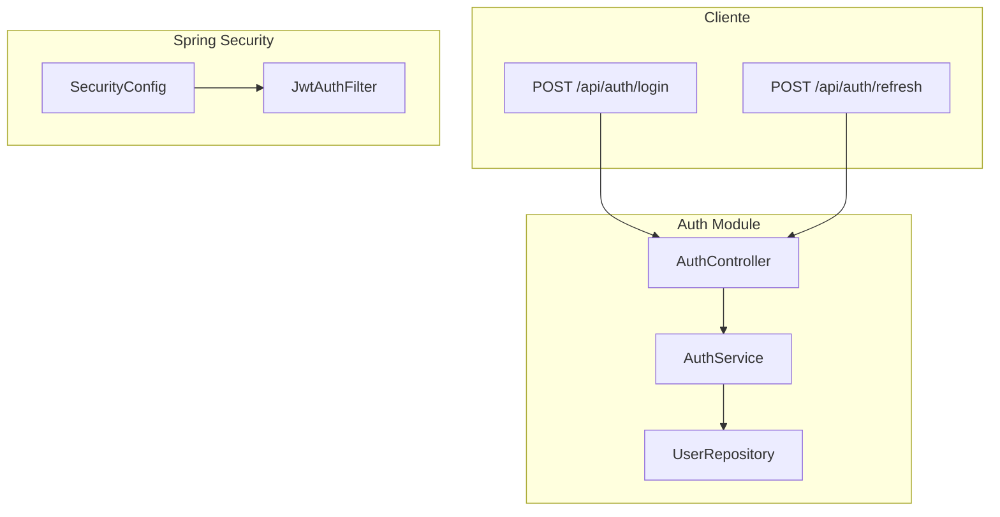

# Plan de Revisión y Mejoras del Backend Inspections

## Resumen del Estado Actual

El backend es una API REST Spring Boot 3.2 con autenticación JWT. Solo está implementado el módulo de **Auth** (login, logout, refresh). Las entidades y repositorios para inspecciones, dispositivos, ubicaciones, etc. existen pero **no tienen controladores ni servicios** asociados.

---

## 1. Seguridad

### 1.1 Crítico: Configuración sensible en código

- **JWT secret** en [application.properties](backend/src/main/resources/application.properties): `app.jwt.secret=InspectionsS3cr3tK3y...` está hardcodeado.
- **Recomendación**: Usar variables de entorno (`${JWT_SECRET}`) y validar que el secret tenga al menos 256 bits para HS256.

### 1.2 Crítico: CORS inseguro

En [SecurityConfig.java](backend/src/main/java/com/inspections/config/SecurityConfig.java) líneas 66-70:

```java
config.setAllowedOriginPatterns(List.of("*"));
config.setAllowCredentials(true);
```

- `allowCredentials(true)` con origen `*` es **incompatible** y puede provocar comportamientos inseguros en producción.
- **Recomendación**: Definir orígenes explícitos (ej. `https://tu-app.com`) y no usar `*` con credenciales.

### 1.3 Medio: H2 Console y frame options

- H2 Console habilitada y `frameOptions` deshabilitados para que funcione.
- **Recomendación**: Deshabilitar H2 en producción (`spring.h2.console.enabled=false`) y usar perfiles (`application-dev.properties` vs `application-prod.properties`).

### 1.4 Medio: User enumeration

En [AuthService.java](backend/src/main/java/com/inspections/service/AuthService.java): mensajes distintos para "usuario no encontrado" vs "contraseña incorrecta" permiten enumerar usuarios válidos.

- **Recomendación**: Usar un mensaje genérico para ambos casos (ej. "Credenciales inválidas").

### 1.5 Bajo: Rate limiting

- No hay límite de intentos de login.
- **Recomendación**: Añadir rate limiting (ej. Bucket4j o Spring Security con intentos por IP).

---

## 2. Manejo de Excepciones

### 2.1 Falta de controlador global

- No existe `@ControllerAdvice` ni `@ExceptionHandler`.
- `UsernameNotFoundException` y `BadCredentialsException` son manejadas por Spring Security con respuestas por defecto (401/403) pero sin formato consistente.
- Errores de validación (`@Valid`) devuelven el formato por defecto de Spring.

**Recomendación**: Crear `GlobalExceptionHandler` con:

- `MethodArgumentNotValidException` → 400 con lista de errores de validación
- `BadCredentialsException` / `UsernameNotFoundException` → 401 con mensaje genérico
- `Exception` genérica → 500 con mensaje controlado (sin exponer stack trace en prod)

---

## 3. Endpoint de Refresh

En [AuthController.java](backend/src/main/java/com/inspections/controller/AuthController.java) línea 47:

```java
@RequestHeader("Authorization") String authorizationHeader
```

- Si el header falta: Spring lanza `MissingRequestHeaderException` → 400.
- Si llega vacío o mal formado: `AuthService.refresh` puede recibir `null` y fallar con NPE al llamar `bearerToken.startsWith(...)`.

**Recomendación**: Hacer el header opcional con `required = false` y validar manualmente, devolviendo 401 si falta o es inválido.

---

## 4. Configuración y Perfiles

### 4.1 Base de datos

- `ddl-auto=create-drop`: los datos se pierden en cada reinicio.
- **Recomendación**: Usar `update` en desarrollo y `validate` en producción; considerar PostgreSQL/MySQL para producción.

### 4.2 Perfiles

- No hay separación dev/prod.
- **Recomendación**: Crear `application-dev.properties` (H2, JWT en properties) y `application-prod.properties` (DB externa, JWT desde env, H2 deshabilitado).

---

## 5. Entidades y Modelo de Datos

### 5.1 Relaciones sin integridad referencial

- Las entidades usan FKs como `String` (ej. `deviceId`, `inspectionId`) sin `@ManyToOne`/`@OneToMany`.
- No hay `@ForeignKey` ni constraints a nivel JPA.
- **Impacto**: Posibles referencias huérfanas si se borran entidades padre.

**Recomendación**: Añadir `@ManyToOne` donde corresponda para integridad, o al menos validar existencia en servicios antes de persistir.

### 5.2 Campos JSON sin validación

- `testStepIds`, `attributeIds`, `valueJson`, `metadataJson`, `fileDetailsJson` se almacenan como TEXT sin validar estructura.
- **Recomendación**: Validar formato JSON en servicios o usar `@Convert` con un atributo tipado.

### 5.3 AuditLog sin uso

- La entidad [AuditLog](backend/src/main/java/com/inspections/entity/AuditLog.java) existe pero no hay servicio que la utilice.
- **Recomendación**: Crear `AuditService` e integrarlo en operaciones sensibles (login, cambios de inspección, etc.).

---

## 6. Tests

- **No hay tests**: `src/test` está vacío.
- **Recomendación**: Añadir al menos:
  - Tests de integración para `AuthController` (login exitoso, credenciales inválidas, refresh)
  - Tests unitarios para `AuthService` y `JwtUtil`

---

## 7. Otras Mejoras


| Área                   | Estado     | Acción sugerida                                                       |
| ---------------------- | ---------- | --------------------------------------------------------------------- |
| Health check           | No hay     | Añadir `spring-boot-starter-actuator` y exponer `/actuator/health`    |
| Documentación API      | Swagger OK | Considerar ejemplos en schemas para DTOs                              |
| Logout                 | Stateless  | Opcional: blacklist de tokens si se requiere invalidación server-side |
| Validación AuthRequest | OK         | Considerar `@Size` en password para evitar strings enormes            |


---

## Diagrama de Flujo Actual (Auth)




---

## Prioridad de Implementación Sugerida

1. **Alta**: GlobalExceptionHandler, validación del header en refresh, CORS y JWT secret por entorno
2. **Media**: Perfiles dev/prod, deshabilitar H2 en prod, mensaje único para credenciales inválidas
3. **Baja**: Tests, AuditService, rate limiting, relaciones JPA en entidades

