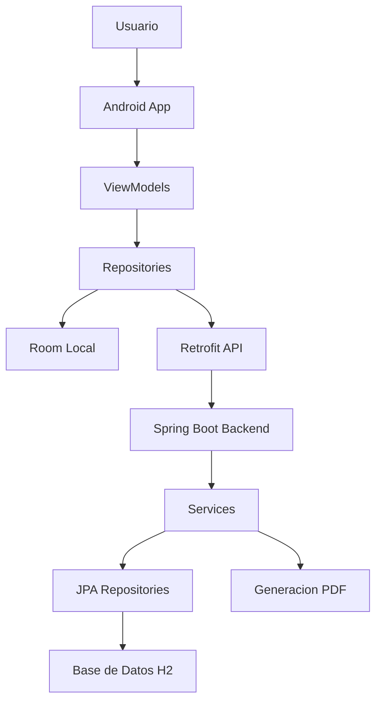

# Guía de defensa oral – Sistema Inspections

Esta guía te prepara para exponer el proyecto de punta a punta en una defensa oral. El texto es técnico pero usa lenguaje simple, y cada sección indica archivos concretos del código que puedes abrir y citar.

---

## 1. Introducción al proyecto y objetivo funcional

### Qué problema resuelve el sistema

**Inspections** es un **sistema de inspección digital** para dispositivos y sistemas contra incendios en edificios y plantas industriales. Antes, estas inspecciones se hacían en papel o en planillas dispersas. Este sistema digitaliza todo el ciclo:

- Asignar inspectores y operadores a una inspección
- Recorrer ubicaciones físicas (pisos, sectores, zonas)
- Revisar dispositivos (extintores, detectores, rociadores, etc.)
- Ejecutar tests (verificaciones técnicas)
- Completar steps (pasos concretos de cada verificación)
- Registrar observaciones y deficiencias, incluso con fotos
- Firmar digitalmente cuando todo está terminado
- Generar y descargar un reporte PDF completo

### Quién usa el sistema

| Rol | Qué hace |
|-----|----------|
| **ADMIN** | Ve todas las inspecciones, gestiona usuarios, crea inspecciones, puede remover al inspector asignado |
| **INSPECTOR** | Crea inspecciones, las inicia, firma al finalizar, puede remover operadores |
| **OPERATOR** | Completa steps en inspecciones asignadas, agrega observaciones, no firma ni crea inspecciones |

### Credenciales de prueba (DataInitializer)

Al iniciar el backend se crean usuarios de prueba:

- `admin@inspections.com` / `Admin1234!` (ADMIN)
- `inspector@example.com` / `Inspector123` (INSPECTOR, asignado a inspecciones de ejemplo)
- `operador@inspections.com` / `Operador123` (OPERATOR)
- `operador1@inspections.com` / `Operador123` (OPERATOR)

**Archivo:** `backend/src/main/java/com/inspections/config/DataInitializer.java`

---

## 2. Arquitectura general del monorepo

### Estructura del proyecto

El proyecto es un **monorepo**: varias partes viven en la misma carpeta y se coordinan entre sí.

```
TUP_FINAL/
├── android-app/     # App móvil (Java, Android)
├── backend/         # API REST (Spring Boot)
├── database/        # Scripts SQL (schema, datos de ejemplo)
├── docs/            # Documentación
└── README.md
```

### Cómo se conectan las piezas



- **Android** usa la app para trabajar en campo.
- **Room** guarda datos localmente (SQLite) para trabajar offline o en cache.
- **Retrofit** hace las llamadas HTTP al backend.
- **Spring Boot** expone la API REST y aplica las reglas de negocio.
- **JWT** protege los endpoints: solo usuarios autenticados pueden acceder.

**Archivos para citar:**

- `README.md` (raíz del proyecto)
- `docs/README.md`
- `docs/TUTORIAL-INICIO.md` (cómo levantar backend y app)

---

## 3. Modelo de datos y jerarquía de inspección

### Jerarquía de seis niveles

La inspección sigue una estructura física y técnica:

```
Inspection (evento principal, vinculado a un edificio)
  └── Location (ubicación: piso, sector, área)
        └── Zone (zona lógica: sala de máquinas, depósito, etc.)
              └── Device (dispositivo: extintor, detector, rociador)
                    └── Test (verificación específica por tipo de dispositivo)
                          └── Step (pasos individuales de verificación)
```

### Estados de la inspección

| Estado | Significado |
|--------|-------------|
| `PENDING` | Pendiente de iniciar |
| `IN_PROGRESS` | En curso |
| `DONE_COMPLETED` | Finalizada correctamente (todos los tests OK) |
| `DONE_FAILED` | Finalizada con fallos (algún test FAILED) |

### Estados de Test y Step

- **Test:** `PENDING`, `COMPLETED`, `FAILED`
- **Step:** `PENDING`, `COMPLETED`, `FAILED` (o `SUCCESS` legacy que se mapea a COMPLETED)
- Si un step es `applicable=false` (N/A), no cuenta para el resultado.

### Contrato de valueJson (step-types-contract)

Cada step guarda su valor en `valueJson`, un JSON que varía según el tipo:

| Tipo | Ejemplo valueJson |
|------|-------------------|
| BINARY | `{"value": true, "valueType": "BOOLEAN_VALUE"}` |
| DATE_RANGE | `{"from": "2025-03-01", "to": "2025-03-15", "valueType": "DATE_RANGE_VALUE"}` |
| SIMPLE_VALUE | `{"value": "OK", "valueType": "STRING_VALUE"}` |
| NUMERIC_RANGE | `{"value": 42, "valueType": "NUMERIC_VALUE"}` (+ minValue/maxValue en columnas) |
| MULTI_VALUE | `{"values": [{"name":"...", "value":"...", "valueType":"..."}]}` |

**Archivos para citar:**

- `database/README.md`
- `docs/step-types-contract.md`
- `backend/src/main/resources/data.sql` (inspecciones, asignaciones, tests, steps de ejemplo)
- `database/schema.sql`

---

## 4. Backend: seguridad, autenticación y reglas de negocio

### Tecnología del backend

- **Spring Boot** (Java 17)
- **JPA/Hibernate** para persistencia
- **Spring Security** + **JWT** (sin sesiones en servidor)
- **OpenAPI/Swagger** para documentar la API
- **H2** en memoria para desarrollo

### Seguridad y JWT

1. **Login:** El usuario envía email y contraseña a `POST /api/auth/login`. El backend valida con BCrypt, genera un JWT y lo devuelve.
2. **Requests siguientes:** La app envía el token en el header `Authorization: Bearer <token>`.
3. **JwtAuthFilter:** Intercepta cada request, valida el JWT, extrae el email y el rol, y llena el `SecurityContext`.
4. **Rutas públicas:** Solo `/api/auth/**`, Swagger y consola H2. Todo lo demás (`/api/**`) exige autenticación.

**Archivos clave:**

- `backend/src/main/java/com/inspections/config/SecurityConfig.java` (permisos, stateless, CORS)
- `backend/src/main/java/com/inspections/security/JwtUtil.java` (creación y validación del token)
- `backend/src/main/java/com/inspections/security/JwtAuthFilter.java` (interceptor de requests)

### Controladores principales

| Controlador | Endpoints relevantes |
|-------------|----------------------|
| **AuthController** | login, register, refresh, forgot/reset password |
| **InspectionController** | listar, crear, firmar, estado |
| **InspectionAssignmentController** | listar/agregar/remover asignaciones |
| **StepController** | listar steps, PATCH para actualizar valor |
| **ObservationController** | crear observaciones por step |
| **InspectionReportController** | GET PDF del reporte |

**Archivos:**

- `backend/src/main/java/com/inspections/controller/InspectionController.java`
- `backend/src/main/java/com/inspections/controller/InspectionAssignmentController.java`
- `backend/src/main/java/com/inspections/controller/InspectionReportController.java`

### Servicios y lógica de negocio

- **InspectionService:** Crear inspección (snapshot de tests/steps), listar por rol, firmar, recalcular estado.
- **InspectionAssignmentService:** Reglas de asignación (1 inspector, N operadores; solo ADMIN remueve inspector).
- **StepService:** Actualizar step, validar valueJson, recalcular estado del test.
- **ObservationService:** Crear observaciones; si es DEFICIENCIES, marca step y test en FAILED.
- **InspectionReportService:** Arma el árbol completo de datos para el PDF.
- **InspectionReportPdfService:** Genera el PDF con OpenPDF.

**Archivos:**

- `backend/src/main/java/com/inspections/service/InspectionService.java`
- `backend/src/main/java/com/inspections/service/StepService.java`
- `backend/src/main/java/com/inspections/service/ObservationService.java`
- `backend/src/main/java/com/inspections/service/InspectionReportService.java`
- `backend/src/main/java/com/inspections/service/InspectionReportPdfService.java`

### Firma de inspección (reglas)

La firma solo es posible cuando:

1. La inspección existe y no está ya firmada.
2. El estado es `IN_PROGRESS`.
3. El usuario autenticado es el INSPECTOR asignado.
4. Todos los tests tienen estado `COMPLETED` o `FAILED` (ninguno PENDING).

Al firmar: se guarda signer, signDate, signed=true, y el status pasa a `DONE_COMPLETED` o `DONE_FAILED` según el resultado de los tests.

---

## 5. Android: navegación, MVVM, Room, Retrofit y Hilt

### Arquitectura de la app

- **MVVM:** Fragment/Activity → ViewModel → Repository.
- **Clean Architecture:** Capas data, di, ui, util.
- **Hilt:** Inyección de dependencias (OkHttp, Retrofit, Room, SharedPreferences).
- **Room:** Base de datos local (entidades, DAOs, AppDatabase).
- **Retrofit:** Llamadas HTTP a la API.
- **Navigation Component:** Navegación por grafo y acciones.
- **ViewModel + LiveData:** Estado observable para la UI.

### Inyección de dependencias (Hilt)

- **AppModule:** Proporciona Retrofit, APIs, SharedPreferences (auth_prefs), AuthInterceptor.
- **DatabaseModule:** Proporciona AppDatabase y todos los DAOs.
- **AuthInterceptor:** Añade `Authorization: Bearer <token>` a cada request desde SharedPreferences.

**Archivos:**

- `android-app/app/src/main/java/com/example/tup_final/di/AppModule.java`
- `android-app/app/src/main/java/com/example/tup_final/di/DatabaseModule.java`
- `android-app/app/src/main/java/com/example/tup_final/data/remote/AuthInterceptor.java`

### Navegación

- **Destino inicial:** Login.
- **Grafo:** Definido en `nav_graph.xml`.
- **BottomNavigation:** Visible solo en Home y Profile.
- **MainActivity:** Contenedor con NavHostFragment.

**Archivos:**

- `android-app/app/src/main/java/com/example/tup_final/MainActivity.java`
- `android-app/app/src/main/res/navigation/nav_graph.xml`
- `android-app/app/src/main/res/layout/activity_main.xml`

### Base de datos local (Room)

- **AppDatabase:** Versión 7, incluye User, Inspection, InspectionAssignment, Location, Zone, Device, Test, Step, Observation, Photo, etc.
- **DAOs:** Cada entidad tiene su DAO (InspectionDao, StepDao, ObservationDao, etc.).
- **Uso:** Los repositorios combinan API y Room (offline-first / cache).

**Archivos:**

- `android-app/app/src/main/java/com/example/tup_final/data/local/AppDatabase.java`
- `android-app/app/src/main/java/com/example/tup_final/data/local/InspectionDao.java`
- `android-app/app/src/main/java/com/example/tup_final/data/local/StepDao.java`

### Repositorios principales

| Repositorio | Responsabilidad |
|-------------|-----------------|
| **AuthRepository** | Login, registro, guardar token y datos en SharedPreferences |
| **InspectionRepository** | Listar inspecciones, detalle, asignaciones, iniciar, firmar, descargar PDF |
| **CreateInspectionRepository** | Edificios, plantillas, crear inspección |
| **StepsRepository** | Cargar y actualizar steps |
| **ObservationRepository** | Crear observaciones, sincronizar con API |
| **InspectionTestsRepository** | Dispositivos por inspección/ubicación |

**Archivos:**

- `android-app/app/src/main/java/com/example/tup_final/data/repository/AuthRepository.java`
- `android-app/app/src/main/java/com/example/tup_final/data/repository/InspectionRepository.java`
- `android-app/app/src/main/java/com/example/tup_final/data/repository/StepsRepository.java`
- `android-app/app/src/main/java/com/example/tup_final/data/repository/ObservationRepository.java`

### Pantallas clave

| Pantalla | Fragment | Descripción |
|----------|----------|-------------|
| Login | LoginFragment | Email/contraseña, llama a AuthRepository |
| Home | HomeFragment | Lista de inspecciones, filtros, FAB crear (solo ADMIN/INSPECTOR) |
| Crear inspección | CreateInspectionFragment | Edificio, tipo, plantilla, fecha, inspector (precargado) |
| Detalle inspección | InspectionDetailFragment | Estado, botones Iniciar/Firmar/Generar reporte, tabs General Info / Devices |
| Info general | GeneralInfoFragment | Asignaciones (inspector/operadores), edificación |
| Ubicaciones | InspectionLocationsFragment | Lista de locations del edificio |
| Tests por zona | InspectionTestsFragment | Árbol zonas → dispositivos → tests |
| Steps | StepsFragment | Lista de steps, input según tipo, botón Completar, agregar observaciones |
| Agregar observación | AddObservationBottomSheet | Tipo (REMARKS/DEFICIENCIES), descripción, foto, tipo de deficiencia |
| Perfil | ProfileFragment | Datos del usuario |
| Gestión usuarios | UserManagementFragment | Solo ADMIN, cambiar roles entre INSPECTOR/OPERATOR |

**Archivos:**

- `android-app/app/src/main/java/com/example/tup_final/ui/home/HomeFragment.java`
- `android-app/app/src/main/java/com/example/tup_final/ui/createinspection/CreateInspectionFragment.java`
- `android-app/app/src/main/java/com/example/tup_final/ui/inspection/InspectionDetailFragment.java`
- `android-app/app/src/main/java/com/example/tup_final/ui/inspection/GeneralInfoFragment.java`
- `android-app/app/src/main/java/com/example/tup_final/ui/inspectiontests/InspectionTestsFragment.java`
- `android-app/app/src/main/java/com/example/tup_final/ui/steps/StepsFragment.java`
- `android-app/app/src/main/java/com/example/tup_final/ui/steps/AddObservationBottomSheet.java`

---

## 6. Flujo funcional completo del usuario

### Login y autenticación

1. Usuario ingresa email y contraseña en LoginFragment.
2. LoginViewModel llama a AuthRepository.login.
3. AuthRepository hace POST a `/api/auth/login`.
4. Backend valida credenciales, genera JWT y devuelve token + datos de usuario.
5. AuthRepository guarda token y datos en SharedPreferences.
6. Navegación a HomeFragment.

### Listar y filtrar inspecciones

1. HomeViewModel llama a InspectionRepository.getInspections.
2. Repository hace GET a `/api/inspections` (con JWT en header).
3. Backend filtra por rol: ADMIN ve todo; INSPECTOR/OPERATOR solo inspecciones asignadas.
4. Se cachean en Room y se muestran en RecyclerView.
5. Filtros: edificio, estado, rango de fechas.

### Crear inspección (ADMIN o INSPECTOR)

1. Usuario toca FAB "Nueva inspección" (solo visible para ADMIN e INSPECTOR).
2. CreateInspectionFragment: selecciona edificio, tipo, plantilla, fecha, inspector (precargado con el usuario actual si es INSPECTOR).
3. CreateInspectionRepository hace POST a `/api/inspections`.
4. Backend crea Inspection en PENDING, genera snapshot de tests y steps, crea asignaciones.
5. Se guarda en Room y se vuelve a Home con la lista actualizada.

### Iniciar o continuar inspección

1. En InspectionDetailFragment, usuario toca "Iniciar inspección" o "Continuar inspección".
2. Si PENDING → backend actualiza a IN_PROGRESS (o la app navega a Locations).
3. Navegación a InspectionLocationsFragment con inspectionId y buildingId.

### Navegar por la jerarquía

1. **Locations** → lista de ubicaciones del edificio.
2. Al elegir una → **InspectionTestsFragment** con zonas, dispositivos y tests.
3. Al tocar un test → **StepsFragment** con la lista de steps de ese test.

### Completar steps

1. StepsFragment muestra cada step según su tipo (BINARY, DATE_RANGE, SIMPLE_VALUE, etc.).
2. Usuario ingresa valor; StepsRepository hace PATCH a `/api/steps/{id}`.
3. Backend actualiza valueJson, recalcula estado del step y del test.
4. Se puede marcar step como N/A (applicable=false) si no aplica.

### Agregar observaciones

1. Desde StepsFragment, usuario abre AddObservationBottomSheet.
2. Elige tipo: REMARKS (observación) o DEFICIENCIES (deficiencia; requiere foto).
3. ObservationRepository persiste local y sincroniza con API.
4. Si es DEFICIENCIES → backend marca step y test en FAILED.

### Firmar inspección

1. Botón "Firmar inspección" visible solo si: IN_PROGRESS, no firmada, usuario es inspector asignado.
2. Al tocar: validación local de que todos los tests estén COMPLETED o FAILED.
3. Diálogo de confirmación con nombre del firmante (resuelto desde UserDao o email).
4. InspectionRepository hace POST a `/api/inspections/{id}/sign`.
5. Backend valida y persiste: signed=true, signDate, signer, status=DONE_COMPLETED o DONE_FAILED.

### Generar y descargar reporte PDF

1. Botón "Generar reporte" visible si: inspección firmada, DONE_COMPLETED o DONE_FAILED, rol INSPECTOR u OPERATOR asignado.
2. InspectionRepository hace GET a `/api/inspections/{id}/report/pdf`.
3. Backend valida permisos, arma InspectionReportData y genera PDF con OpenPDF.
4. App guarda el PDF en Documents o cache, abre con FileProvider (visor o compartir).

---

## 7. El corazón del sistema: Tests, Steps y Observaciones

### Por qué es el núcleo

El valor del sistema está en estructurar las verificaciones técnicas (tests), sus pasos concretos (steps) y las observaciones o deficiencias detectadas. Esto permite trazabilidad y reportes consistentes.

### Tests

- Cada **Test** pertenece a un **Device** y a una **Inspection**.
- Se crean al crear la inspección (snapshot desde plantillas).
- Estados: PENDING, COMPLETED, FAILED.
- El test pasa a COMPLETED cuando todos los steps aplicables están COMPLETED.
- El test pasa a FAILED si algún step aplicable está FAILED (por ejemplo, por una deficiencia).

### Steps

- Cada **Step** pertenece a un **Test**.
- Tiene tipo (`testStepType`): BINARY, DATE_RANGE, SIMPLE_VALUE, NUMERIC_RANGE, MULTI_VALUE.
- El valor se guarda en `valueJson` según el contrato de `step-types-contract.md`.
- `applicable=false` significa N/A: no se valida y no afecta el resultado del test.

### Observaciones

- **REMARKS:** Comentario o nota. No cambia el estado del step.
- **DEFICIENCIES:** Deficiencia detectada. Requiere foto (`mediaId`). Marca step y test en FAILED.

**Archivos para citar:**

- `backend/src/main/java/com/inspections/service/StepService.java`
- `backend/src/main/java/com/inspections/service/ObservationService.java`
- `android-app/app/src/main/java/com/example/tup_final/ui/steps/StepsFragment.java`
- `android-app/app/src/main/java/com/example/tup_final/ui/steps/StepsAdapter.java`
- `android-app/app/src/main/java/com/example/tup_final/ui/steps/AddObservationBottomSheet.java`
- `docs/step-types-contract.md`

---

## 8. Reporte PDF: qué hace, cómo se genera y cómo se descarga

### Contenido del PDF

- Portada: resultado (APROBADA/REPROBADA), tipo, edificio, fechas, firmante, ID.
- Asignaciones: inspector y operadores.
- Resumen ejecutivo: cantidades (locations, zones, devices, tests, steps, observaciones, deficiencias, fotos).
- Detalle jerárquico: Location → Zone → Device → Test → Step → Observaciones.
- Tabla de deficiencias.
- Nota: fase 1 sin imágenes embebidas; solo metadatos de fotos.

### Flujo técnico

1. Android: InspectionDetailFragment → InspectionDetailViewModel → InspectionRepository.downloadInspectionReport.
2. Repository: GET `/api/inspections/{id}/report/pdf` con JWT.
3. Backend: InspectionReportController → InspectionReportService.buildReportData → InspectionReportPdfService.generatePdf.
4. InspectionReportService valida: inspección firmada, DONE_*, usuario asignado como inspector u operador.
5. InspectionReportPdfService arma el documento con OpenPDF (com.lowagie.text).
6. Respuesta: Content-Type application/pdf, Content-Disposition attachment.
7. Android: guarda bytes en Documents o cache, devuelve Resource<File>.
8. Fragment abre con Intent.ACTION_VIEW o Intent.ACTION_SEND (FileProvider).

**Archivos:**

- `backend/src/main/java/com/inspections/controller/InspectionReportController.java`
- `backend/src/main/java/com/inspections/service/InspectionReportService.java`
- `backend/src/main/java/com/inspections/service/InspectionReportPdfService.java`
- `backend/src/main/java/com/inspections/dto/report/InspectionReportData.java`
- `android-app/app/src/main/java/com/example/tup_final/data/repository/InspectionRepository.java` (método downloadInspectionReport)
- `android-app/app/src/main/java/com/example/tup_final/ui/inspection/InspectionDetailFragment.java` (openOrSharePdf)
- `android-app/app/src/main/res/xml/file_paths.xml` (paths para FileProvider)

---

## 9. Mejoras y correcciones aplicadas (contexto de la conversación)

Estas mejoras se implementaron durante el desarrollo del proyecto y conviene mencionarlas en la defensa:

### Roles unificados

- Se reemplazó SUPERVISOR por OPERATOR.
- Roles finales: ADMIN, INSPECTOR, OPERATOR.
- ADMIN ve todas las inspecciones; INSPECTOR y OPERATOR solo las asignadas.
- Solo ADMIN puede remover al inspector asignado; INSPECTOR puede remover operadores.

### Creación de inspecciones

- Botón "Crear inspección" solo para ADMIN e INSPECTOR (FAB visible según rol).
- Backend: `@PreAuthorize("hasAnyRole('ADMIN','INSPECTOR')")` en POST /api/inspections.
- Pre-carga del email del inspector al crear: el usuario actual se asigna automáticamente y ve su inspección en la lista.

### Botón "Generar reporte"

- Visible cuando: inspección firmada, DONE_COMPLETED o DONE_FAILED, usuario INSPECTOR u OPERATOR asignado.
- Si la carga de asignaciones llega vacía localmente, se muestra igual para INSPECTOR/OPERATOR (el backend valida al descargar).
- Descarga, guardado local y apertura/compartido vía FileProvider.

### Firma de inspección

- Validación previa: todos los tests en COMPLETED o FAILED.
- Diálogo de confirmación con nombre del firmante.
- Transición a DONE_COMPLETED o DONE_FAILED según resultado de los tests.

---

## 10. Guion sugerido para la defensa oral (3–4 minutos)

**1. Presentación (30 s)**  
"El proyecto es un sistema de inspección digital para dispositivos contra incendios. Digitaliza todo el ciclo: asignación, recorrido por ubicaciones y zonas, ejecución de tests y pasos, observaciones con fotos, firma digital y reporte PDF."

**2. Arquitectura (45 s)**  
"Hay una app Android para campo y un backend Spring Boot como API REST. Android usa Room para datos locales y Retrofit para llamar al backend. La autenticación es con JWT: el usuario hace login, recibe un token, y ese token va en cada request. El backend aplica las reglas de negocio: quién puede crear inspecciones, quién puede firmar, quién puede descargar el reporte."

**3. Modelo de datos (30 s)**  
"La inspección sigue una jerarquía de seis niveles: Inspection, Location, Zone, Device, Test y Step. Cada test tiene varios steps con diferentes tipos de valor: binario, rango de fechas, valor numérico, etc. Los valores se guardan en un campo JSON según un contrato único entre app y backend."

**4. Flujo principal (60 s)**  
"Un inspector o admin crea una inspección eligiendo edificio, tipo y plantilla. El backend genera automáticamente los tests y steps. Luego, el inspector o operador recorre las ubicaciones, completa los steps y puede agregar observaciones o deficiencias con fotos. Si hay una deficiencia, el step y el test pasan a FAILED. Cuando todos los tests están completos, el inspector firma digitalmente. La inspección pasa a DONE_COMPLETED o DONE_FAILED. Después, inspectores y operadores asignados pueden descargar un reporte PDF con toda la información."

**5. Tecnologías (30 s)**  
"En Android: MVVM, Hilt, Room, Retrofit, Navigation Component. En backend: Spring Boot, JPA, Spring Security con JWT, OpenPDF para el reporte. La base de datos es H2 en desarrollo."

**6. Cierre (15 s)**  
"El sistema está operativo end-to-end: login, listado, creación, ejecución de steps, observaciones, firma y descarga del PDF. Si quieren, puedo mostrar el código de una parte concreta."

---

## 11. Lista priorizada de archivos para estudiar

### Antes de la defensa (orden sugerido)

1. **Visión general**
   - [README.md](README.md)
   - [docs/README.md](docs/README.md)
   - [docs/TUTORIAL-INICIO.md](docs/TUTORIAL-INICIO.md)
   - [database/README.md](database/README.md)
   - [docs/step-types-contract.md](docs/step-types-contract.md)

2. **Backend – seguridad y auth**
   - [backend/src/main/java/com/inspections/config/SecurityConfig.java](backend/src/main/java/com/inspections/config/SecurityConfig.java)
   - [backend/src/main/java/com/inspections/security/JwtUtil.java](backend/src/main/java/com/inspections/security/JwtUtil.java)
   - [backend/src/main/java/com/inspections/security/JwtAuthFilter.java](backend/src/main/java/com/inspections/security/JwtAuthFilter.java)
   - [backend/src/main/java/com/inspections/config/DataInitializer.java](backend/src/main/java/com/inspections/config/DataInitializer.java)

3. **Backend – inspecciones y negocio**
   - [backend/src/main/java/com/inspections/controller/InspectionController.java](backend/src/main/java/com/inspections/controller/InspectionController.java)
   - [backend/src/main/java/com/inspections/service/InspectionService.java](backend/src/main/java/com/inspections/service/InspectionService.java)
   - [backend/src/main/java/com/inspections/service/StepService.java](backend/src/main/java/com/inspections/service/StepService.java)
   - [backend/src/main/java/com/inspections/service/ObservationService.java](backend/src/main/java/com/inspections/service/ObservationService.java)
   - [backend/src/main/java/com/inspections/controller/InspectionReportController.java](backend/src/main/java/com/inspections/controller/InspectionReportController.java)
   - [backend/src/main/java/com/inspections/service/InspectionReportService.java](backend/src/main/java/com/inspections/service/InspectionReportService.java)
   - [backend/src/main/java/com/inspections/service/InspectionReportPdfService.java](backend/src/main/java/com/inspections/service/InspectionReportPdfService.java)

4. **Android – estructura y datos**
   - [android-app/app/src/main/java/com/example/tup_final/di/AppModule.java](android-app/app/src/main/java/com/example/tup_final/di/AppModule.java)
   - [android-app/app/src/main/java/com/example/tup_final/data/local/AppDatabase.java](android-app/app/src/main/java/com/example/tup_final/data/local/AppDatabase.java)
   - [android-app/app/src/main/java/com/example/tup_final/data/repository/AuthRepository.java](android-app/app/src/main/java/com/example/tup_final/data/repository/AuthRepository.java)
   - [android-app/app/src/main/java/com/example/tup_final/data/repository/InspectionRepository.java](android-app/app/src/main/java/com/example/tup_final/data/repository/InspectionRepository.java)

5. **Android – UI y flujo**
   - [android-app/app/src/main/java/com/example/tup_final/MainActivity.java](android-app/app/src/main/java/com/example/tup_final/MainActivity.java)
   - [android-app/app/src/main/res/navigation/nav_graph.xml](android-app/app/src/main/res/navigation/nav_graph.xml)
   - [android-app/app/src/main/java/com/example/tup_final/ui/home/HomeFragment.java](android-app/app/src/main/java/com/example/tup_final/ui/home/HomeFragment.java)
   - [android-app/app/src/main/java/com/example/tup_final/ui/inspection/InspectionDetailFragment.java](android-app/app/src/main/java/com/example/tup_final/ui/inspection/InspectionDetailFragment.java)
   - [android-app/app/src/main/java/com/example/tup_final/ui/inspection/InspectionDetailViewModel.java](android-app/app/src/main/java/com/example/tup_final/ui/inspection/InspectionDetailViewModel.java)
   - [android-app/app/src/main/java/com/example/tup_final/ui/steps/StepsFragment.java](android-app/app/src/main/java/com/example/tup_final/ui/steps/StepsFragment.java)
   - [android-app/app/src/main/java/com/example/tup_final/ui/steps/AddObservationBottomSheet.java](android-app/app/src/main/java/com/example/tup_final/ui/steps/AddObservationBottomSheet.java)

---

**Documento generado como guía de defensa oral del proyecto Inspections – TUP Final.**
